<h3 align="center">
  
</h3>

  
  
  
  

  
  
  
  

---

## 👋 About Me

I build companies and run delivery. By day I'm the **Technical Project Manager at [Platformz](https://platformz.us)** — running three client platforms with a **30+ person** cross-functional team — with full QA ownership and CEO/CTO/CFO/CMO & board reporting. I'm also the **Founder & CEO of [AZAI Labs](https://azailabs.dev)**, where we build with agents, not headcount.

My engineering track spans six years of QA, automation, reliability, and software delivery — including **Intelex via TCS**, **Mastercard**, **Kintsugi (AI tax compliance, SF — Sr. SDET)**, **Grameenphone (MyGP)**, **Kinetik (NYC healthcare)**, and global insurance clients — plus **23 Upwork jobs, every one rated ★5.0 (Top Rated)**.

- 🚚 Delivered a 12-month **3P hybrid EDI program in ~60 days** (Amazon, Walmart, Target, Chewy)
- 🏪 FUR4 live on **Chewy, Amazon, Walmart, eBay & Macy's** — 5 portals on a Magento core
- 🧪 Built the **complete backend automation framework for MyGP** (Bangladesh's largest operator) from zero
- 💥 Ran **chaos engineering** on payment-critical systems at Mastercard

### Career snapshot

| Period | Role | Organization |
|---|---|---|
| **Sep 2024 – Present** | Technical Project Manager | Platformz |
| **Sep 2025 – Aug 2026** | Sr. Software QA Engineer · SDET | Kintsugi |
| **Jan 2025 – Jun 2025** | Sr. Software Automation & Reliability Engineer | Mastercard |
| **2024 – 2025** | Augmented Sr. Software QA Engineer | Intelex via TCS · US client |
| **Feb 2024 – May 2026** | Software Automation Engineer II | All Generation Tech |
| **Feb 2024 – Mar 2025** | Software QA Engineer | Grameenphone via Miaki · MyGP |
| **Sep 2023 – Sep 2025** | Software QA Engineer I | Kinetik |

> Several roles ran in parallel across consulting, augmentation, and remote delivery engagements.

---

## 🚀 What I'm Building

| Venture | What it is |
|---|---|
| 🤖 [**AZAI Labs**](https://azailabs.dev) | Build with agents, not headcount — AI products, services & augmented AI talent |
| 🎓 [**AZADEMY**](https://azademy.org) | Learning meets earning — practical AI & tech courses, real interviews, remote-career training |
| ✦ [**Personal Brand Studio**](https://azantor.xyz/personal-brand-studio) | Premium personal-brand websites, built for you — live work: [azantor.xyz](https://azantor.xyz) · [sharif-abid.xyz](https://sharif-abid.xyz) · [timothymunroroberts.com](https://timothymunroroberts.com) |
| 🎙️ [**AZA Execution Podcast**](https://azapodcast.com) | Ideas are cheap. Execution is everything. |
| 📚 [**Listen2AZA**](https://www.youtube.com/@Listen2AZA) | Audiobooks people press play on |
| 🌱 [**SSAS Foundation**](https://ssasf.vercel.app) | Scholarships, mentorship & Quran education — in honor of my father |

---

## 🛠️ Skills — Prioritized & At a Glance

> **How to read this:** 🥇 = expert, my daily drivers — hire me for these. 🥈 = advanced, ship-to-production strength. 🥉 = solid working knowledge.

| Priority | Domain | What I actually do | Tools & tech |
|:---:|---|---|---|
| 🥇 | **Technical Program / Project Management** | Run delivery end-to-end: roadmaps, sprint & release management, cross-team coordination of 30+ people, stakeholder reporting, risk & scope control — compressed a 12-month EDI program into ~60 days | Jira · Confluence · QASE · Kanban flow metrics · release gates · RAID logs |
| 🥇 | **QA & Test Automation Engineering** | Architect automation frameworks from zero (web, mobile, API), set QA strategy & release gates, lead QA teams — built MyGP's complete backend framework, run FUR4's 5-portal QA | Playwright · Selenium · Cypress · Appium · REST Assured · Postman · TestRail · Allure · BrowserStack — **[full QA arsenal ⬇](#-the-full-qa--testing-arsenal)** |
| 🥇 | **AI Engineering & Agents** | Build custom AI agents & agentic workflow automation (AZAI Labs), LLM apps on Claude & OpenAI APIs, MCP integrations, AI-powered QA (self-healing tests, visual AI), and teach it all via AZADEMY | Claude API · OpenAI API · MCP · AI agent frameworks · Claude Code · Applitools · prompt engineering |
| 🥈 | **Software Engineering** | Full-stack feature delivery: typed backends, REST/GraphQL APIs, React frontends, e-commerce (Magento) — feature lead at an AI tax-compliance startup | TypeScript · JavaScript · Python · Java · Node.js · React · Next.js · GraphQL · Magento · MongoDB · MySQL |
| 🥈 | **Performance & Load Engineering** | Load, stress, soak & spike testing with CI-integrated thresholds — payment-critical and telecom-scale systems | k6 · JMeter · Locust · LoadRunner · Gatling |
| 🥈 | **Security Testing** | OWASP-based security testing, vuln scanning, pentest-style assessments as part of release QA | OWASP ZAP · Burp Suite · Kali Linux |
| 🥈 | **DevOps, Cloud & CI/CD** | Pipelines that gate on quality, containerized test infra, IaC | AWS (Lambda · SQS · S3 · EC2) · Docker · Terraform · Jenkins · GitHub Actions · GitLab CI · Bitbucket Pipelines |
| 🥉 | **Reliability & Observability** | Chaos engineering on payment-critical systems (Mastercard), dashboards & alerting | Prometheus · Grafana · InfluxDB · chaos experiments |
| 🥉 | **Design & Content** | Design collaboration, 3D/interactive web, podcasting & video production | Figma · Three.js · Tailwind · YouTube/podcast production |

  

### 🧪 The Full QA & Testing Arsenal

Every QA discipline I practice, in one place — 6+ years across payments, healthcare, telecom, insurance & e-commerce.

| QA Discipline | Skills & tools |
|---|---|
| 🧠 **Test Strategy & Types** | Test planning · test-case design · risk-based testing · exploratory testing · functional · regression · smoke & sanity · UAT coordination · cross-browser & cross-device · shift-left testing |
| 🌐 **Web UI Automation** | Playwright (TypeScript/Python) · Selenium WebDriver · Cypress · Page Object Model · data-driven frameworks · self-healing locators · parallel execution grids |
| 📱 **Mobile QA** | Appium (iOS & Android) · BrowserStack · AWS Device Farm · Xamarin Test Cloud · real-device & emulator labs · app release testing |
| 🔌 **API & Integration Testing** | Postman · REST Assured · Swagger/OpenAPI validation · GraphQL testing · contract & schema testing · service mocking & stubs · webhook testing |
| 📦 **EDI & Supply-Chain Testing** | X12 documents (850 · 810 · 856 · 997) · AS2 · 3P/marketplace integration QA (Amazon · Walmart · Target · Chewy) · order-to-invoice flow validation |
| ⚡ **Performance & Load** | k6 · JMeter · LoadRunner · Gatling · Locust · load, stress, soak & spike testing · CI-integrated thresholds · InfluxDB + Grafana result dashboards |
| 🔐 **Security Testing** | OWASP Top 10 · OWASP ZAP · Burp Suite · Kali Linux · auth & session testing · payment-flow security (Mastercard) |
| 👁️ **Visual & Accessibility** | Applitools visual AI · visual regression · WCAG accessibility checks · responsive/viewport testing |
| 🥒 **BDD & Test Frameworks** | Cucumber/Gherkin · TestNG · JUnit · PyTest · Jest/Mocha · fixtures & factories · keyword-driven design |
| 📋 **Test Management & Process** | TestRail · QASE · Jira/Xray-style workflows · Allure reporting · defect triage · release gates · QA metrics (escape rate, flake rate, coverage) |
| 💥 **Reliability & Chaos** | Chaos engineering on payment-critical systems · failure injection · monitoring-driven QA (Prometheus/Grafana) |
| 🤖 **AI-Assisted QA** | Self-healing test suites · AI test generation · visual AI · agentic QA workflows (AZAI Labs) |
| 🏭 **Domain Expertise** | E-commerce (Magento, 5-portal marketplace ops) · payments/fintech · healthcare (NYC) · telecom (Bangladesh's largest operator) · insurance · civic tech (OpenCRVS) |

### 🤖 What I can do with AI

- **Build agents that do real work** — custom AI agents & multi-agent workflows for QA, ops, and business automation (AZAI Labs: *build with agents, not headcount*)
- **LLM application engineering** — Claude & OpenAI APIs, MCP servers/integrations, prompt engineering, evals
- **AI-powered quality** — self-healing test suites, visual AI testing (Applitools), AI test generation
- **AI-assisted delivery** — agentic coding workflows (Claude Code) baked into real production teams
- **Teach & train** — AI courses, workshops and real interview prep via [AZADEMY](https://azademy.org)

---

## 📌 Featured Work

- 📘 [**qa-roadmap**](https://azaworld.github.io/qa-roadmap/) — **the complete QA curriculum** (Manual · Automation · AI · API · Performance · Security): a gamified site from zero to Sr. QA, with real examples, an AI + MCP capstone, and my [AZADEMY](https://azademy.vercel.app/) courses
- 🎮 [**my-portfolio**](https://github.com/azaworld/my-portfolio) — [azantor.xyz](https://azantor.xyz): gamified 3D portfolio (XP, achievements, living résumé)
- 🧪 [**playright-qa-automation---industry-grade**](https://github.com/azaworld/playright-qa-automation---industry-grade) — industry-grade Playwright framework
- 📈 [**Fur4-Load-Testing-K6**](https://github.com/azaworld/Fur4-Load-Testing-K6) — k6 load-testing suite for the FUR4 platform
- 🐳 [**playwright-e2e-docker-aws**](https://github.com/azaworld/playwright-e2e-docker-aws) — EcomTestPilot: Playwright E2E in Docker on AWS

---

## 📊 GitHub Stats

  
  

  

  

---

## 💼 Upwork — Top Rated, Perfect Score

| | |
|---|---|
| 🏅 **Badge** | Top Rated |
| ✅ **Jobs completed** | 23 |
| ⭐ **Rating** | 5.0 on every single job — no exceptions |
| 🌍 **Clients** | US, UK & global — healthcare, fintech, e-commerce, telecom, insurance |
| 🔗 **Hire me** | [upwork.com/freelancers/~01b1ba72ba57683f43](https://www.upwork.com/freelancers/~01b1ba72ba57683f43) |

---

## 🤝 Work With Me

| Service | What you get |
|---|---|
| 🧭 **Fractional TPM / Delivery Lead** | Roadmap prioritization, cross-team coordination, stakeholder reporting — chaos in, shipped products out |
| 🧪 **QA & Automation Consulting** | Manual + automation strategy, framework builds, API/security/performance testing, release-gate setup |
| 🤖 **AI Agents (AZAI Labs)** | Custom agent development & agentic workflow automation for quality and operations |
| 🎤 **Instruction & Speaking** | AI & tech courses, podcast guesting/hosting, event MC, interview coaching |
| 🧑‍💼 **Hiring & Technical Interviews** | Technical screening, hiring scorecards, interview-prep coaching |

  

**📬 [arifuzantor@gmail.com](mailto:arifuzantor@gmail.com) · 🌐 [azantor.xyz](https://azantor.xyz) · response time: usually < 24h**
